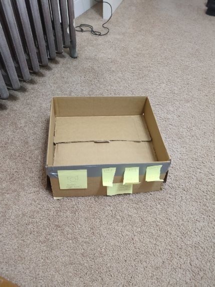

## ECSE 395 
## 03/06/25
# Weekly activities:
## For week 8, our team met with Ju-Hung on Monday and discussed our project plan, along with our technical and functional specs. I finished my prototype for the cat bowl monitoring system and recorded a video of it. It prototypes the lifted cat bowl, with switches to switch between monitoring food and water. The button starts and resets the timer, and the time remaining before a refill is needed is represented with three red LEDs. I also modified and submitted the functional specs, technical specs, and project plan document on Thursday based off the feedback from Ju-Hung and Dr. Block. I also submitted our document with our prototypes on Saturday, including reflections for each prototype and videos of them being used.

